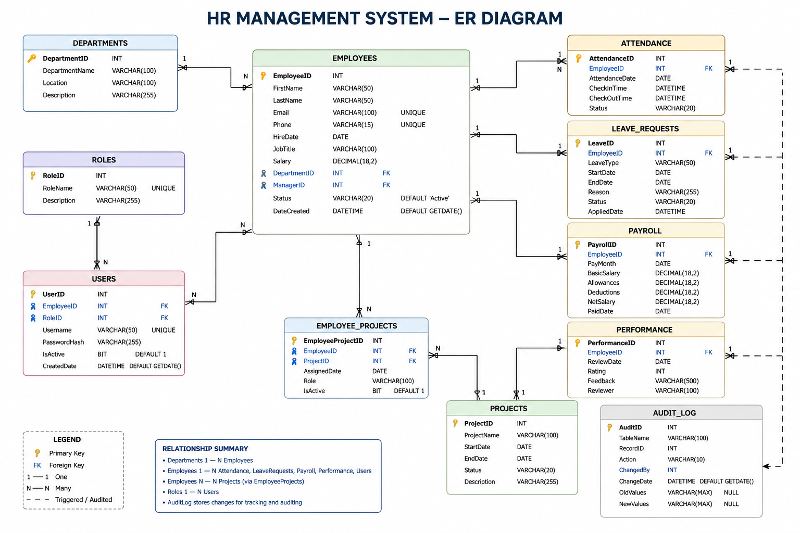

# HR Management System - SQL Server

## Project Overview

This project is a complete Human Resource Management System built using Microsoft SQL Server. It demonstrates database design, normalization, T-SQL programming, stored procedures, views, functions, triggers, indexing, and query optimization.

---

## Entity Relationship Diagram

The following ER diagram illustrates the database schema and relationships between the major entities in the HR Management System.

---

## Technologies Used

- Microsoft SQL Server
- SQL Server Management Studio (SSMS)
- T-SQL
- Git
- GitHub

## Features

- Employee Management
- Department Management
- Attendance Tracking
- Payroll Management
- Leave Management
- Performance Reviews
- Project Management
- User & Role Management
- Audit Logging
- Query Optimization using Indexes

## Database Objects

### Tables

- Departments
- Employees
- Attendance
- LeaveRequests
- Payroll
- Performance
- Projects
- EmployeeProjects
- Roles
- Users
- AuditLog

### Views

- vw_EmployeeDetails
- vw_PayrollSummary
- vw_AttendanceSummary
- vw_LeaveSummary
- vw_ProjectAssignments
- vw_DepartmentSalarySummary

### Stored Procedures

- usp_AddEmployee
- usp_UpdateEmployee
- usp_DeleteEmployee
- usp_SearchEmployee
- usp_GetPayrollReport
- usp_AttendanceReport
- usp_DepartmentSalaryReport
- usp_ApproveLeave
- usp_GetEmployeePerformance

### Functions

- fn_CalculateExperience
- fn_AnnualSalary
- fn_FullName
- fn_DepartmentEmployeeCount
- fn_TotalPayroll

### Triggers

- trg_EmployeeAudit
- trg_PayrollAudit
- trg_PreventDelete

### Indexes

- Employee Email Index
- Department & Salary Composite Index
- Hire Date Covering Index
- Phone Unique Index

## Repository Structure

HR-Management-System-SQL
│
├── Database
├── Queries
├── Views
├── Stored_Procedures
├── Functions
├── Triggers
├── Indexes
├── Screenshots
├── README.md
└── LICENSE

## Skills Demonstrated

- Database Design
- Normalization
- Primary Keys
- Foreign Keys
- Constraints
- Joins
- Views
- Stored Procedures
- User Defined Functions
- Triggers
- Indexing
- Aggregate Functions
- Window Functions
- Transactions
- Performance Optimization

## Future Enhancements

- Role-Based Access Control
- Dashboard Integration using Power BI
- REST API Integration
- Automated Backup Scripts
- Data Encryption

## Author

**Ranjith Kumar**

- **GitHub:** [ranjithpasam](https://github.com/ranjithpasam)
- **Project Repository:** [HR-Management-System-SQL](https://github.com/ranjithpasam/HR-Management-System-SQL)
- **LinkedIn:** [Ranjith Kumar](https://www.linkedin.com/in/ranjithkumarpasam/)
